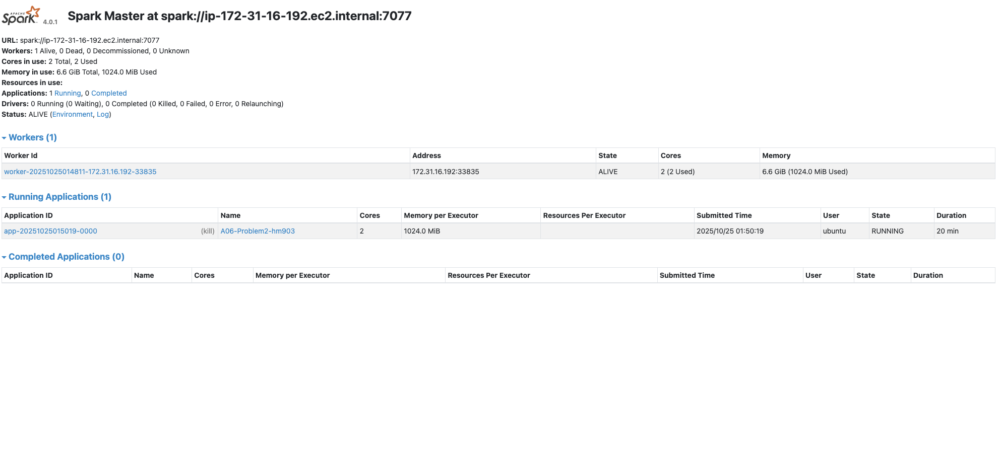
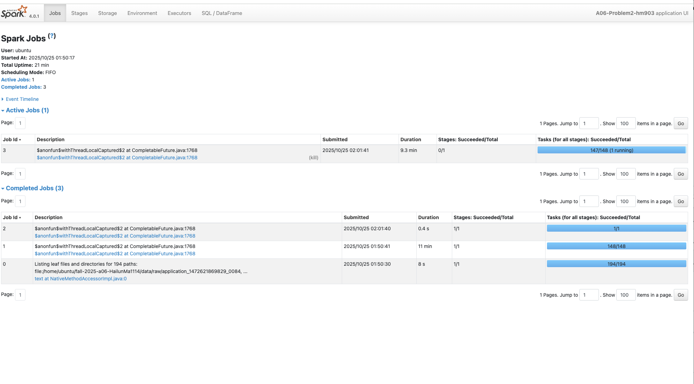

## Problem 1 — Log Level Distribution
For Problem 1, I used Spark DataFrame APIs to read all log files recursively, extract log levels with a regular expression, and aggregate counts for INFO, WARN, ERROR, and DEBUG. After cleaning invalid lines, I computed the frequency of each level and wrote three deliverables: problem1_counts.csv, problem1_sample.csv, and problem1_summary.txt. The summary showed that INFO logs dominated (>99.9%), while ERROR and WARN made up less than 0.1%. This indicates stable system operation with minimal issues. The Spark job ran efficiently due to vectorized regex extraction and partition-level aggregation.

## Problem 2 — Cluster Usage Analysis
In Problem 2, I parsed cluster application logs to construct timelines and summaries of cluster activity. Each log line was parsed for cluster_id, application_id, and timestamps, and Spark was used to compute per-application start and end times as well as per-cluster aggregations. The outputs (problem2_timeline.csv, problem2_cluster_summary.csv, and problem2_stats.txt) were then visualized with bar and density plots. Analysis revealed six unique clusters, with one ( 1485248649253 ) handling over 93% of applications, indicating a highly centralized workload. The duration distribution was heavily right-skewed, showing many short jobs and a few very long ones. This suggests batch processing patterns and potential for load balancing or job scheduling optimization. The Spark run was I/O-bound, with most time spent scanning and grouping logs, but coalescing outputs to single files ensured clean submission artifacts.

## Performance and Insights
Both pipelines demonstrated that Spark is well-suited for large-scale log and cluster analysis, especially when regex extraction and groupBy operations are pushed to the executors. From Problem 1, the key insight is that system health was stable with almost no critical failures. From Problem 2, the cluster analysis shows a clear dominant compute node and long-tail job distribution, implying that capacity planning should prioritize the most active cluster while smaller ones can be scaled down or repurposed. Overall execution was stable and reproducible on the Spark cluster, with the 4040 UI confirming task parallelism and successful stage completion.

